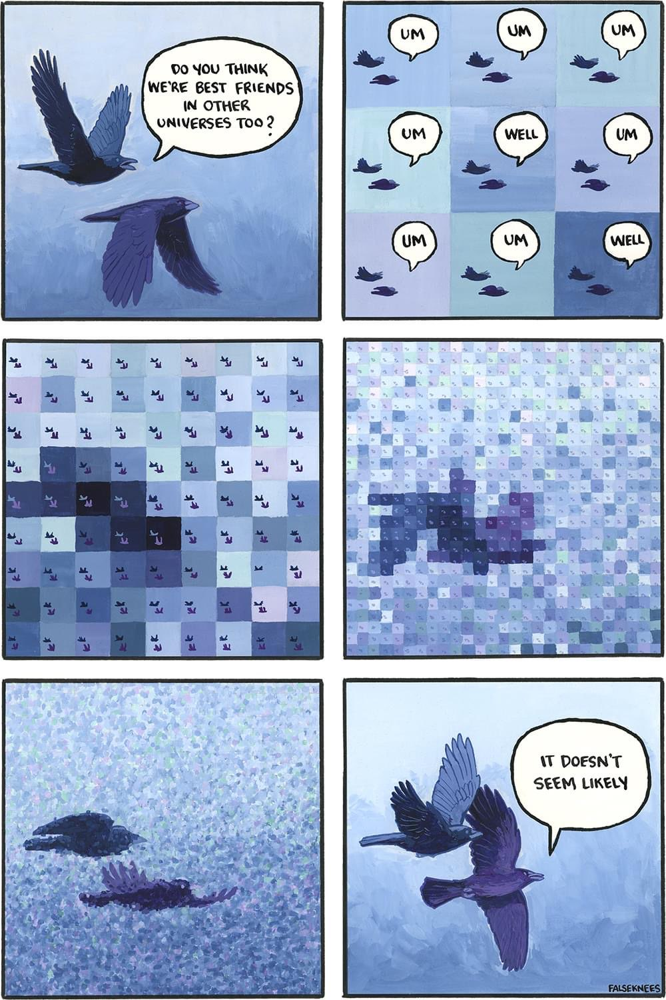

# 🌌 Another Universe

*"ถ้าตัวละครสองคนได้พบกันในโลกที่แตกต่างออกไป เรื่องราวของพวกเขาจะยังเหมือนเดิมไหม?"*

**Another Universe** เป็น Extension สำหรับ [SillyTavern](https://github.com/SillyTavern/SillyTavern) ที่จะพาสวมบทบาทตัวละครของคุณกระโดดข้ามมิติไปยังโลกคู่ขนาน โดยนำบุคลิกและความสัมพันธ์ที่กำลังดำเนินอยู่ มาตีความใหม่ผ่านสถานการณ์และอารมณ์ที่แตกต่างกัน

---

## ✨ Features (จุดเด่น)

* **🎭 30,000+ Unique Variations:** ผสมผสาน 30 ธีมโลก, 34 เหตุการณ์การพบกัน (Encounter), และ 32 โทนอารมณ์ (Mood) หรือจะเลือก 'ไม่ระบุ' เพื่อเปิดกว้างก็ได้ ทำให้เกิดความเป็นไปได้มหาศาล!
* **🤯 Wild Themes:** ตั้งแต่ละครไทย, ตำนานไทย, ครึ่งสัตว์, ดึกดำบรรพ์, จีนกำลังภายใน, ซอมบี้, มาเฟีย, แวมไพร์, โลกในเกม, วนลูปเวลา และอีกมากมาย!
* **🔥 Dark & Spicy Options:** ขยายฐานตัวเลือกให้ครอบคลุมถึงสายมืดและสายแซ่บ! (เช่น ยันเดเระ, เลือดสาด, สลับร่าง, แฟนกำมะลอ, คลุมถุงชน, คนกับผี, สัญญากับปีศาจ)
* **🛡️ Proxy Safe & Context Aware:** ระบบแยก Context อัจฉริยะ ซ่อนประวัติแชทเพื่อป้องกัน AI แต่งเรื่องต่อแชทเดิม (แก้ปัญหา Reverse Proxy) แต่ยังคงวิเคราะห์ดึงเอา "เคมีและน้ำเสียง" ปัจจุบันมาใช้แต่งเรื่องในโลกคู่ขนาน
* **⚡ Quick Settings:** ปุ่มลัด `🌌` ข้างช่องแชท เปิดหน้าต่างตั้งค่าด่วน เลือกธีมแล้วเจนเนื้อเรื่องได้ทันทีโดยไม่ต้องเปิดแผงตั้งค่าหลัก
* **📚 Universe Gallery:** ระบบจัดเก็บประวัติเรื่องราวที่สุ่มได้ 20 รายการล่าสุด พร้อมระบบ "ติดดาว (Favorite) ⭐" ให้เรื่องโปรดของคุณ
* **📸 Export to Image:** บันทึกเรื่องราวเป็นรูปภาพสุดพรีเมียมได้ 2 สไตล์ (Long Card แบบเต็มเรื่อง และ Short Card แบบ Cinematic โชว์โควทเด็ด)
* **📱 Universal UI:** ระบบ Popup แบบใหม่ รองรับการใช้งานผ่านมือถือ แท็บเล็ต และคอมพิวเตอร์ได้อย่างสมบูรณ์แบบ จัดกึ่งกลางหน้าจอเสมอ 

---

## 🛠️ การติดตั้ง (Installation)

1. คัดลอกโฟลเดอร์ `another-universe`
2. นำไปวางในโฟลเดอร์ของ SillyTavern ตามเส้นทางนี้:
   `SillyTavern/public/scripts/extensions/third-party/another-universe`
3. รีสตาร์ทหรือรีเฟรชหน้าต่าง SillyTavern (F5)

---

## 💡 วิธีการใช้งาน (Usage)

1. เปิดแผงควบคุม Extensions ใน SillyTavern เลื่อนหา **Another Universe** แล้วติ๊กถูกที่ช่อง `Enabled`
2. จะมีปุ่มรูปกาแล็กซี (`🌌`) ปรากฏขึ้นที่มุมขวาล่าง หรือข้างๆ ช่องพิมพ์แชท
3. กดปุ่ม `🌌` เพื่อเปิดหน้า **Quick Settings**
4. เลือกรูปแบบที่ต้องการ:
   * **Theme:** โลกแบบไหนที่คุณอยากไป (เช่น ไซเบอร์พังค์, แฟนตาซียุคกลาง)
   * **Encounter:** เหตุการณ์การพบกัน (มีให้เลือกเพียบ! ตั้งแต่เจอกันครั้งแรก, ศัตรู, ไปจนถึงสลับร่าง หรือเด็กเลี้ยง)
   * **Mood:** โทนของเรื่อง (โรแมนติกหวานซึ้ง, ปวดตับ, เร่าร้อน, ไปจนถึงยันเดเระ)
   * *สามารถเลือก "❌ ไม่ระบุ" ได้ หากไม่ต้องการฟิกซ์เหตุการณ์หรืออารมณ์*
5. กดปุ่ม **✨ Generate** แล้วรอรับเรื่องราวในโลกคู่ขนานได้เลย!
6. เมื่อได้เรื่องราวแล้ว สามารถกดไอคอน **📸 ถ่ายรูป** เพื่อบันทึกเป็นรูปภาพ (เลือกได้ 2 สไตล์)
7. สามารถกลับมาดูเรื่องราวเก่าๆ ได้โดยการกดปุ่ม **📚 Gallery**

---

## 🔧 ติดต่อสอบถาม / เสนอแนะ

หากพบปัญหาในการใช้งาน เกิดรอยร้าวระหว่างมิติ หรือมีโลกใบใหม่ที่อยากให้เพิ่มเข้าไป สามารถติดต่อได้ที่:
**Discord: majesty.pop (POPKO)**

---

## 📜 License & Terms of Use (ข้อตกลงการใช้งาน)

Extension นี้ใช้ **Custom License** เฉพาะ ดูรายละเอียดเต็มได้ที่ไฟล์ [LICENSE](./LICENSE)

> [!WARNING]
> **สำคัญมาก (CRITICAL):**
> โปรเจกต์นี้เกิดจากการเขียนโค้ดด้วยความสนุกสนาน เพื่อแบ่งปันให้ผู้เล่นในคอมมูนิตี้ได้ใช้งานฟรี 
> 
> 1. **ห้ามใช้เพื่อการค้า (Non-Commercial Only):** ห้ามนำไปใช้เพื่อแสวงหาผลกำไรหรือเชิงพาณิชย์โดยเด็ดขาด
> 2. **อนุญาตให้ Fork / ดัดแปลงได้ (Open Source):** สามารถนำโค้ดไปพัฒนาต่อยอดได้
> 3. **ห้ามปิดซอร์สโค้ด (No Closed Source):** งานดัดแปลงต้องเปิดเผยซอร์สโค้ดเสมอ
> 4. **ต้องให้เครดิต (Attribution):** ต้องระบุที่มาว่ามาจาก Another Universe โดย POPUKO
> 
> 
> *หากพบเห็นผู้ใดฝ่าฝืน จะดำเนินการแจ้งกับทุกคอมมูนิตี้ที่เกี่ยวข้องทันที*

---

## 🌌 แรงบันดาลใจ (Inspiration)

*"Do you think we're best friends in other universes too?"*

---
*Created with magic and curiosity. ✨*
